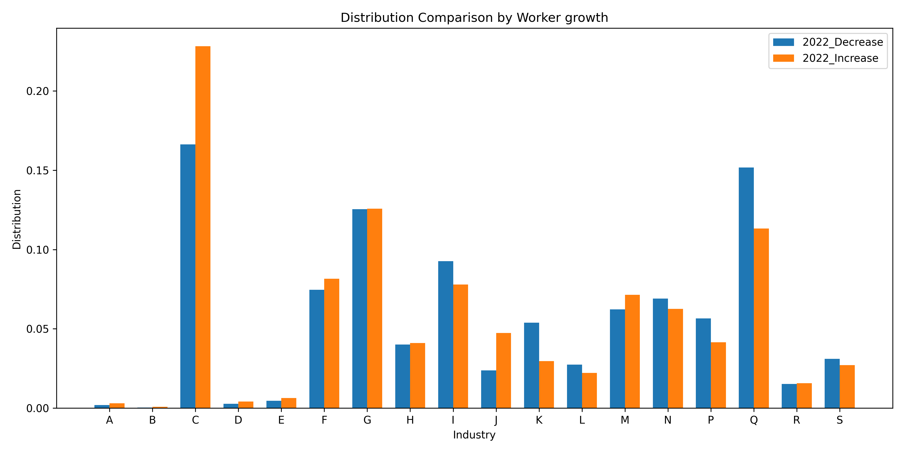
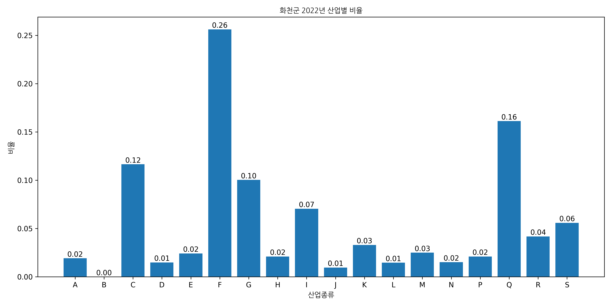
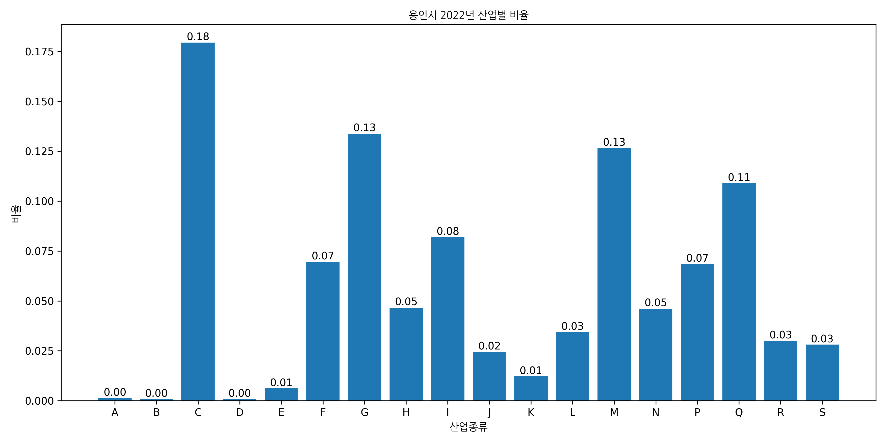

# 🧠 IndustryForecast: Machine Learning–Based Industrial Workforce Prediction

This project analyzes changes in regional industrial structures using real-world employment data from 2017 to 2022.  
By combining statistical analysis and machine learning, it predicts the direction of industrial growth and decline for 2023.  
Chi-square tests were used to verify that industrial compositions differ significantly between population-increasing and population-decreasing regions.  
Subsequently, Random Forest and K-Nearest Neighbor classifiers were trained to model these regional trends, and a soft-voting ensemble achieved the highest accuracy.  

Results show that:
- **Population-decreasing regions** are dominated by **construction (26%)**, **health & social welfare (16%)**, and **manufacturing (12%)**.  
- **Population-increasing regions** are led by **manufacturing (18%)**, **professional & technical services (13%)**, and **retail trade (13%)**.  
- The model achieved an accuracy of **83%**, with strong generalization in predicting industrial growth patterns.  

These findings provide an interpretable foundation for **regional policy planning** and **industrial strategy design** based on workforce transitions.

--- 
## 🧰 Technologies Used
**Python**, **scikit-learn**, **pandas**, **matplotlib**, **seaborn**, **NumPy**

---
## 📂 Project Structure
```
├── dataset/                            # Raw and intermediate CSV data files
├── graphfolder/                        # Generated industry distribution graphs by region
├── NanumGodic/                         # Korean font file (NanumGothic.ttf)
│
├── df_industry.csv                     # Processed dataset with labeling results
├── industry_distribution_analysis.py   # Regional industry ratio visualization & Chi-square analysis
├── MLmodel.py                          # Machine learning model (RF + KNN Voting Classifier)

```
---

## 🚀 How to Run
### Clone the repository
```bash
git clone https://github.com/daewook1004/IndustryForecast.git
cd IndustryForecast
```

### Install dependencies

```
pip install pandas numpy matplotlib seaborn scikit-learn
```
### Run the industry distribution analysis

This script performs:
- Regional 2022 industry ratio calculations
- Automatic graph generation by region
- Chi-square test comparing increasing vs decreasing population regions

```
python industry_distribution_analysis.py
```
Output:
- df_industry.csv (with labeling and ratios)
- graphfolder/*.png (region-wise bar charts)
- graphfolder/decrease_increase_2022_industry_distribution.png

### Run the machine learning model
This script trains RandomForest and KNN models to predict 2023 trends.
```
python MLmodel.py
```
Output:
- Model accuracy and confusion matrices printed in console
- Predicted labels for 2023 saved in df_goal.csv
---
## 📊 Example Results
### 🧮 Chi-square Test
| Statistic        | p-value          | Interpretation                                                                                     |
| ---------------- | ---------------- | -------------------------------------------------------------------------------------------------- |
| χ² = 304,484.359 | p = 0.0 (< 0.05) | Industrial composition differs significantly between increasing and decreasing population regions. |

### 🏙 Top Industries by Region Type
<p align="center">
  
</p>

| Region Type             | Major Industries (2022)                                           |
| ----------------------- | ----------------------------------------------------------------- |
| **Population Decrease** | Construction (26%), Health & Welfare (16%), Manufacturing (12%)   |
| **Population Increase** | Manufacturing (18%), Technical Services (13%), Retail Trade (13%) |


### Example Regions by Population Trend  

#### 📉 Population Decrease Example — *Hwacheon-gun (화천군)*  
<p align="left">
  
</p>

| Industry Type | Percentage (2022) |
| -------------- | ---------------- |
| Construction | **26%** |
| Health & Welfare Services | **16%** |
| Manufacturing | **12%** |
| Others | 46% |

> The workforce in Hwacheon-gun is heavily concentrated in the construction and public welfare sectors,  
> indicating reliance on traditional and public industries in population-declining areas.


#### 📈 Population Increase Example — *Yongin-si (용인시)*  
<p align="left">
  
</p>

| Industry Type | Percentage (2022) |
| -------------- | ---------------- |
| Manufacturing | **18%** |
| Professional & Technical Services | **13%** |
| Retail Trade | **13%** |
| Others | 56% |

> Yongin-si shows a high share in manufacturing and technical services,  
> reflecting an active industrial base and continuous job creation.

### 🤖 Machine Learning Model — Prediction of Industrial Change (2023)

To predict whether each regional industry will experience growth or decline, we trained multiple classifiers and selected an ensemble Voting model combining RandomForest and K-Nearest Neighbor (KNN) based on accuracy and F1 performance.

#### ⚙️ Model Configuration
| Model                 | Key Parameters                                                         |
| --------------------- | ---------------------------------------------------------------------- |
| **RandomForest**      | n_estimators=90, max_depth=17, min_samples_split=5, min_samples_leaf=1 |
| **KNN**               | n_neighbors=8, metric=‘euclidean’, weights=‘distance’                  |
| **Voting (Ensemble)** | Soft voting combining RF and KNN classifiers                           |


#### 📈 Performance Evaluation

| Model                 | Accuracy  | Macro F1 | Weighted F1 | Notes                                             |
| --------------------- | --------- | -------- | ----------- | ------------------------------------------------- |
| **RandomForest**      | 83.1%     | 0.73     | 0.83        | Strong generalization, stable recall              |
| **KNN**               | 80.5%     | 0.72     | 0.80        | Sensitive to local patterns                       |
| **Voting (RF + KNN)** | **83.1%** | **0.73** | **0.83**    | Best overall balance between recall and precision |

Among all labels, small_increase and big_increase achieved the highest recall (0.92 and 0.74 respectively), while big_decrease showed lower recall due to smaller class size (22 samples).


## Discussion: Policy Insight and Implications
| Insight                      | Description                                                                                           |
| ---------------------------- | ----------------------------------------------------------------------------------------------------- |
| **Industrial Concentration** | Population-decreasing regions show reliance on construction and welfare sectors.                      |
| **Growth Dynamics**          | Manufacturing and technical service sectors drive employment growth in increasing-population regions. |
| **Policy Recommendation**    | Workforce support and diversification in declining areas can balance regional disparities.            |
| **Model Utilization**        | The trained model can serve as a forecasting tool for regional policy planning and industry strategy. |


